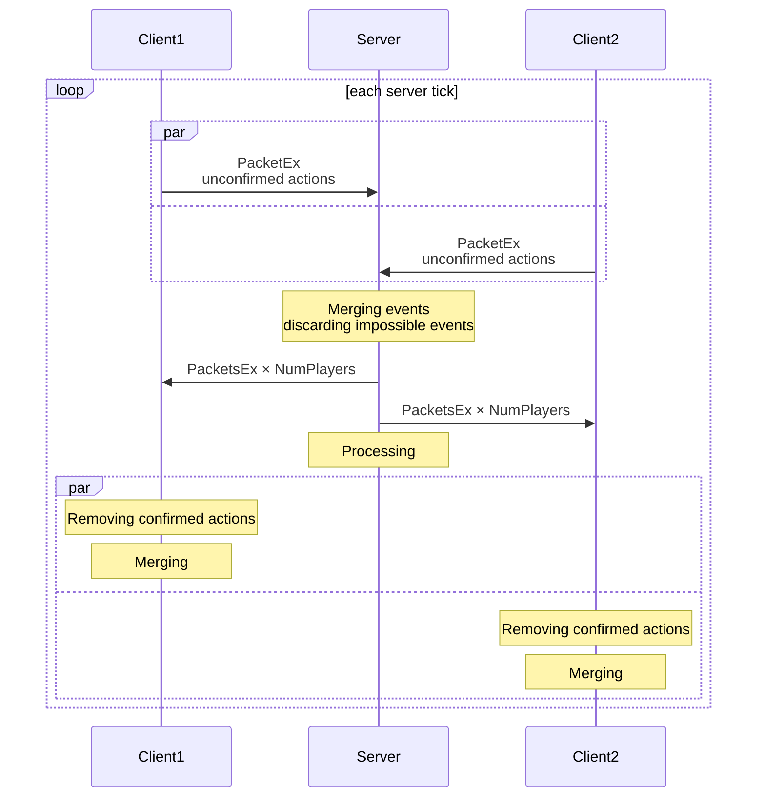
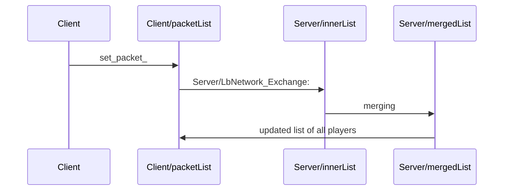

## High level

## Layers

Logical layers are a bit messy now.
Each layer should abstract away some specific problem.

| layer                  | targed desc                | now state                        |
| ---------------------- |  -----                     |   --------------------------                                         |
| packets.c              | make_packet/process_packet |  now it is processing packets synced by next layer                   |
| bflib_network.c        | medium level wrapper       | it is just trying to sync packets between server and all clients     |
| internal network layer | not supported anymore      | some code about IPX, Modem etc                                       |
| bflib_tcpsp.c          | -----                      | lowlevel wrappers (basically + just `readfrom client#`)              |

## Low level

TODO: this part should be implemented only when layer are clarifyed

https://mermaid-js.github.io/mermaid-live-editor/
